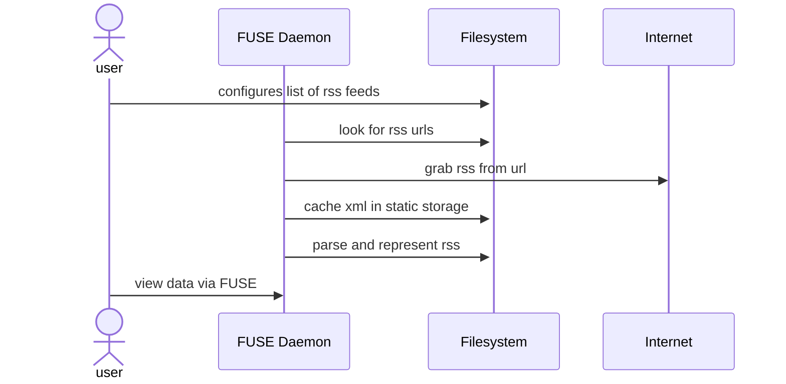

## Architecture

## Structure

* Config Dir (eg $XDG_CONFIG/fuse-rss)
  * subscriptions
    * $my-subscription-name (eg npr)
* Cache Dir (eg $HOME/.fuse-rss-cache/)
  * subscriptions
    * $my-subscription-name
      * feed.xml
      * articles
        * guid
* Mounted Dir (eg $HOME/fuse/)
  * subscriptions (eg $HOME/fuse/subscriptions/)
    * $my-subscription-name (eg $HOME/fuse/subscriptions/npr)
      * image
      * description
      * link
      * items
        * $article_name_guid (eg $HOME/fuse/subscriptions/npr/items/ARTICLE_NAME/)
          * title
          * description
          * published
          * link

## Dev Plan

1. Given cache directory full of rss files, generate fuse representation on startup
2. Given config directory with subscriptions, fetch rss files and generate fuse representation on startup
3. Given config directory with subscriptions, fetch rss files, and scrape content on startup
4. Given config directory with subscriptions, lazily fetch rss files, and lazily scrape content on file read
5. Move config into the fuse fs. moving, deleting, updating files should regnerate rss structures

## Future Work

1. 'bookmarks' - instead of rss, store singular urls that can be accessed the same way
2. 'enriched' - use a local llm to scrape instead of storing raw html